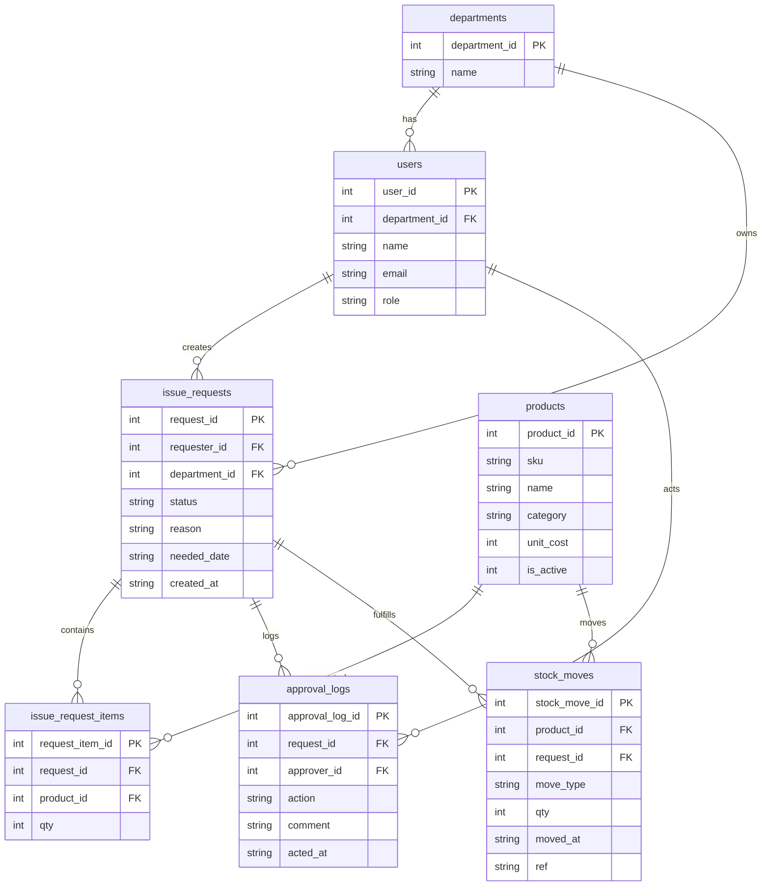

# ERD｜簽核領用 + 庫存（可展示作品）

## 設計重點（為什麼這樣拆）
- **單據與明細分開**：`issue_requests` / `issue_request_items`（避免重複欄位、支持多品項）
- **簽核紀錄獨立**：`approval_logs`（追溯「誰在何時做了什麼」）
- **庫存異動不可改**：`stock_moves` 寫入後不更新，只能用反向異動修正（可追溯）
- **角色/部門獨立**：方便做權限與報表（部門排行、主管待核准）

## ERD（Mermaid）

## 正規化（簡述）
- 產品資訊只放在 `products`
- 申請單主檔只放申請層級欄位（申請人、用途、狀態）
- 申請品項用明細表存多筆
- 簽核與庫存異動用「事件」概念獨立保存，避免修改歷史造成追溯困難

