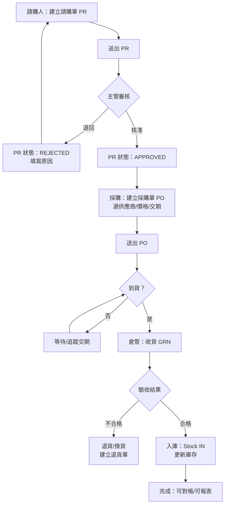

# 採購到入庫（P2P）｜流程設計整理（可展示作品）

## 1) 目標
- 讓採購需求可追溯、可核准、可入庫
- 讓「誰提出、誰核准、誰收貨」清楚分工
- 讓資料從請購單 → 採購單 → 收貨單一致串起來

## 2) 角色與權限（簡化版）
- **請購人**：建立/送出請購、查看狀態、可在未核准前取消
- **部門主管**：核准/退回請購
- **採購**：轉採購單、選供應商、議價、送出採購單
- **倉管/收貨**：收貨入庫、驗收、處理短溢到貨
- **會計/財務**：依收貨/發票對帳（此作品略）

## 3) 流程圖（Mermaid）

## 4) 單據與狀態（可被驗收）
### PR（請購單）
- 狀態：`DRAFT` → `PENDING_APPROVAL` → `APPROVED / REJECTED / CANCELLED`
- 欄位（示例）：請購人、部門、需求日期、用途、明細（品項/數量/預算）

### PO（採購單）
- 狀態：`DRAFT` → `SENT` → `PARTIALLY_RECEIVED / RECEIVED / CANCELLED`
- 欄位（示例）：供應商、交期、議價後單價、付款條件、明細

### GRN（收貨單）
- 狀態：`CREATED` → `QC_PASSED / QC_FAILED`
- 欄位（示例）：到貨數量、驗收結果、短溢到貨原因、入庫倉別

## 5) 報表（用來衡量流程）
- 採購週期：PR 核准到 PO 送出的平均天數
- 到貨準時率：到貨日 vs 交期
- 短溢到貨：短交/溢交比例與原因
- 供應商採購金額與品項集中度

## 6) 我在這個作品要展示的能力
- 把流程拆解成「節點/狀態/資料」並能被驗收
- 把角色權責寫清楚，避免權限混亂
- 從流程推導出管理報表（讓管理可視化）

